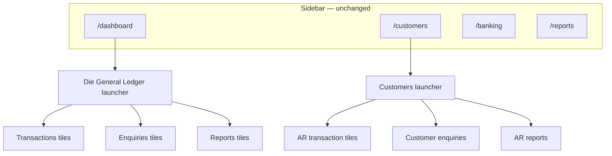

# Dashboard redesign — design & development document

**Source:** `Dashboard.pdf` (green highlight markup, May 2026)  
**Reference screenshots:** `docs/dashboard-pdf-page1.png`, `docs/dashboard-pdf-page2.png`

---

## Vision

Replace the current KPI-card home (`app/dashboard/page.tsx`) with a **Pastel-style module launcher**: three colour-coded bands per screen — **Transactions** (red), **Enquiries** (blue), **Reports** (purple) — each tile navigating to an existing route or a planned stub.

The PDF defines two module home screens:

| PDF page | Module title | Route |
|----------|--------------|-------|
| 1 | Die General Ledger | `/dashboard` (default home) |
| 2 | Customers | `/customers` (hub; list/detail as child routes) |

Sidebar nav stays for cross-module jumps. Module hubs are the "morning landing" for each area. Only **green-highlighted** tiles are in scope for v1.

---

## Navigation model



**Principle:** Config-driven tiles live in `lib/dashboard/modules.ts`. Pages only render `<ModuleLauncher config={…} />`. No business logic in tile components.

---

## Scope (highlighted tiles from PDF)

### Page 1 — Die General Ledger

| Section | In-scope tiles |
|---------|----------------|
| **Transactions** | Transactions, Cashbook Batches, Journal Batches, Bank Reconciliation, Transactional Export |
| **Enquiries** | Ledger Enquiries |
| **Reports** | Reports, Account Transactions, Balance Sheet, Bank Reconciliation, Cashbook, Income Statement, Trial Balance |

**Out of scope (v1):** Case Ware Export, Journal Transfer, Control Account Reconciliation, Enquiries (parent hub), Project Ledger Enquiries, Account Balances, Audit Trail, Budgets, Chart of Accounts, Cheques Printed, Open Batches, Project Budget vs Actual, Project P&L, Revised Budget History.

### Page 2 — Customers

| Section | In-scope tiles |
|---------|----------------|
| **Transactions** | Transactions, Statement Run, Interest Charging, Credit Note, Invoice |
| **Enquiries** | Enquiries, Transaction Enquiries |
| **Reports** | Reports, Age Analysis, Allocations, Customer Listing, Sales Analysis, Statements, Transactions |

**Out of scope (v1):** AR Batches, Post-dated Cheques Due, Send Mail Merge, Sales Order, Standard, Mail Merge Email History, Delivery Addresses, Electronic Document Audit Trail, Labels, Post Dated Cheques, Rep Commissions, Top Sales.

---

## Route mapping

Legend: **Exists** = shippable today · **Partial** = related screen, not 1:1 · **New** = needs page/API

### General Ledger (`/dashboard`)

| Tile | Target route | Status | Build action |
|------|-------------|--------|--------------|
| Transactions | `/journal` | **Exists** | Wire |
| Cashbook Batches | `/banking` | **Partial** | Wire (v1 = banking home; batch list Phase 6) |
| Journal Batches | `/journal` | **Partial** | Wire (v1 = journal list; batch model Phase 6) |
| Bank Reconciliation | `/banking` | **Exists** | Wire |
| Transactional Export | `/dashboard/export` | **New** | Stub → Phase 6 |
| Ledger Enquiries | `/ledger` | **Exists** | Wire |
| Reports (hub) | `/reports` | **Exists** | Wire |
| Account Transactions | `/ledger` | **Partial** | Wire (dedicated report optional Phase 6) |
| Balance Sheet | `/reports/balance-sheet` | **Exists** | Wire |
| Bank Reconciliation (report) | `/banking` | **Exists** | Wire (duplicate label — Pastel parity) |
| Cashbook | `/banking` | **Partial** | Wire |
| Income Statement | `/reports/income-statement` | **Exists** | Wire |
| Trial Balance | `/reports/trial-balance` | **Exists** | Wire |

### Customers (`/customers`)

| Tile | Target route | Status | Build action |
|------|-------------|--------|--------------|
| Transactions | `/sales` | **Exists** | Wire |
| Statement Run | `/customers/statements/run` | **New** | Stub → Phase 5 |
| Interest Charging | `/customers/interest` | **New** | Stub → Phase 6 |
| Credit Note | `/sales/credit-note` | **Partial** | Stub → Phase 6 |
| Invoice | `/sales/new` | **Exists** | Wire |
| Enquiries | `/customers/enquiries` | **New** | Hub stub → Phase 4 |
| Transaction Enquiries | `/customers/enquiries/transactions` | **New** | Stub → Phase 4 |
| Reports (hub) | `/customers/reports` | **New** | Hub stub → Phase 5 |
| Age Analysis | `/customers/reports/age-analysis` | **Partial** | Phase 5 |
| Allocations | `/customers/allocations` | **Partial** | Phase 5 |
| Customer Listing | `/customers/listing` | **Exists** | Wire (moved from current `/customers`) |
| Sales Analysis | `/customers/reports/sales-analysis` | **New** | Phase 5 |
| Statements | `/customers/reports/statements` | **New** | Phase 5 |
| Transactions (report) | `/customers/reports/transactions` | **New** | Phase 5 |

---

## UI specification

### Layout

- Page title: module name ("Die General Ledger", "Customers").
- Three stacked sections with coloured headers matching PDF:
  - **Transactions** — red band (`--launcher-txn` / `var(--negative)`)
  - **Enquiries** — blue band (`--launcher-enquiry`)
  - **Reports** — purple band (`--launcher-report`)
- Each section: responsive grid of pill/button tiles (~4–5 per row desktop; wrap/stack on mobile).
- **Wire** tiles → `Link` to route; navigate immediately.
- **Stub** tiles → route exists with "Coming soon" + back link; no 404.

### KPI strip (GL home only)

**Option A — recommended:** Collapsible "At a glance" strip above the launcher: cash, AR, VAT (reuse `/api/kpi`), 6-month income-vs-expense chart (reuse `/api/charts`). Extract from `app/dashboard/page.tsx` into `components/dashboard/GlanceStrip.tsx`. Launcher is primary; KPIs secondary.

**Option B:** Remove KPIs from home entirely; keep on `/reports` and `/customers` only.

*Default: Option A. Confirm before Phase 2.*

### Components

```
components/dashboard/
  ModuleLauncher.tsx      # title + sections[]
  LauncherSection.tsx     # coloured header band + tile grid
  LauncherTile.tsx        # label, href, status: wire | soon
  GlanceStrip.tsx         # collapsible KPI row (GL only)

lib/dashboard/
  modules.ts              # GENERAL_LEDGER_TILES, CUSTOMERS_TILES config
  types.ts                # LauncherModule, LauncherSection, LauncherTile

app/customers/_components/
  ComingSoon.tsx          # reused by all unbuilt routes under /customers/*
```

---

## Implementation phases

### Phase 1 — Launcher framework

**Goal:** Reusable Pastel launcher renders from config; no business logic.

| ID | Task | Done |
|----|------|------|
| 1.1 | CSS tokens: `--launcher-txn`, `--launcher-enquiry`, `--launcher-report` | [ ] |
| 1.2 | Implement `LauncherTile`, `LauncherSection`, `ModuleLauncher` | [ ] |
| 1.3 | `lib/dashboard/types.ts` + `lib/dashboard/modules.ts` (both module configs) | [ ] |
| 1.4 | Dev-only preview at `/dashboard/preview` or unit snapshot (optional) | [ ] |

**Done when:** GL config renders 13 tiles in three sections with correct colours; tiles without `href` show "Soon".

---

### Phase 2 — General Ledger home

**Goal:** `/dashboard` becomes Die General Ledger launcher; KPIs preserved in glance strip.

| ID | Task | Done |
|----|------|------|
| 2.1 | Replace `app/dashboard/page.tsx` with `ModuleLauncher` + GL config | [ ] |
| 2.2 | Wire all Exists / Partial GL tiles to routes (table above) | [ ] |
| 2.3 | Add stub `app/dashboard/export/page.tsx` (Transactional Export) | [ ] |
| 2.4 | Extract `GlanceStrip` from current page; wire `/api/kpi` + `/api/charts` | [ ] |
| 2.5 | Header quick actions: + Invoice → `/sales/new`, + Journal → `/journal` | [ ] |

**Done when:** Every PDF page 1 highlight is a clickable tile; zero 404s; glance strip loads data.

---

### Phase 3 — Customers home

**Goal:** `/customers` becomes Customers launcher; directory relocated to sub-route.

| ID | Task | Done |
|----|------|------|
| 3.1 | Move current customer list UI to `app/customers/listing/page.tsx` | [ ] |
| 3.2 | New `app/customers/page.tsx` = Customers `ModuleLauncher` config | [ ] |
| 3.3 | Wire Invoice, Transactions, Customer Listing tiles | [ ] |
| 3.4 | Add `ComingSoon` stubs for all New routes under `app/customers/**` | [ ] |
| 3.5 | Update all internal links that pointed to `/customers` (table) → `/customers/listing` | [ ] |

**Done when:** Every PDF page 2 highlight is a tile; Customer Listing opens directory.

---

### Phase 4 — Enquiries hubs

**Goal:** Blue-section tiles open useful read-only views; no GL writes from enquiry screens.

| ID | Task | Done |
|----|------|------|
| 4.1 | Enhance `/ledger`: filters (account, date range, posted only), paginated lines | [ ] |
| 4.2 | `/customers/enquiries` hub with link cards to sub-pages | [ ] |
| 4.3 | `/customers/enquiries/transactions` — filter by customer, date, doc type | [ ] |
| 4.4 | `GET /api/enquiries/customer-transactions` (paginated; `is_posted = true`) | [ ] |

**Done when:** No enquiry tile is a dead stub; all enquiry views are read-only.

---

### Phase 5 — Customer reports

**Goal:** Minimum viable implementation for all highlighted customer report tiles.

| ID | Task | Done |
|----|------|------|
| 5.1 | `/customers/reports` hub (links to sub-reports) | [ ] |
| 5.2 | **Age Analysis** — AR buckets per customer (`acct_invoices` + due dates) | [ ] |
| 5.3 | **Customer Listing** — ensure redirect to `/customers/listing` | [ ] |
| 5.4 | **Transactions report** — invoices + payments per customer/period | [ ] |
| 5.5 | **Statements** — single-customer HTML/PDF preview | [ ] |
| 5.6 | **Statement Run** — batch statements for all customers with open balance | [ ] |
| 5.7 | **Sales Analysis** — revenue by customer/period (revenue accounts + invoice lines) | [ ] |
| 5.8 | **Allocations** — payments applied to invoices (reuse allocation patterns) | [ ] |

**Done when:** Each customer report tile opens a working screen, or documents deferral with target phase.

---

### Phase 6 — GL gaps & AR documents

**Goal:** Close remaining highlighted items that need new behaviour.

| ID | Task | Done |
|----|------|------|
| 6.1 | **Transactional Export** — CSV download, date range, posted lines only | [ ] |
| 6.2 | **Account Transactions** — dedicated report if distinct from ledger enquiry | [ ] |
| 6.3 | **Cashbook / Journal Batches** — define batch entity or document v1 alias | [ ] |
| 6.4 | **Credit Note** — `doc_type` on `acct_invoices` + `/sales/credit-note` GL post rules | [ ] |
| 6.5 | **Interest Charging** — rate config + charge run + GL entry | [ ] |

**Done when:** Transactional Export downloads; Credit Note and Interest Charging leave "Soon" state.

---

## Future modules (same pattern)

| Module | Route | Notes |
|--------|-------|-------|
| Suppliers | `/suppliers` | Mirror Customers structure |
| Purchases | `/purchases` | AP transactions + reports |
| Payroll | `/payroll` | Already has run flow; add launcher |
| VAT 201 | `/vat` | Returns + clearing |
| Setup | `/setup` | COA, company, bank accounts |

---

## Technical constraints

- **Auth:** Session middleware on all routes (same as today; `middleware.ts`).
- **GL reads:** Enquiries and reports use `is_posted = true` only — audit alignment.
- **Writes:** Tiles never post to GL; they only navigate to existing write flows.
- **Deploy:** Coolify unchanged — UI + optional API routes only.
- **Architecture:** One config file per module (`lib/dashboard/modules.ts`); thin `page.tsx` files; no GL business logic in tile components.

---

## Progress tracker

| Phase | Focus | Tasks | Done |
|-------|-------|-------|------|
| 1 | Launcher components | 4 | 3 (1.4 preview skipped) |
| 2 | GL dashboard | 5 | 5 |
| 3 | Customers dashboard | 5 | 5 |
| 4 | Enquiries | 4 | 0 |
| 5 | Customer reports | 8 | 0 |
| 6 | GL gaps & AR docs | 5 | 0 |
| **Total** | | **31** | **13** |

Phases 1–3 shipped: launcher framework, GL home with collapsible glance strip, Customers hub, and all New routes stubbed (no 404s). Unit tests cover utils, ledger balance logic, and module config. Phases 4–6 (real enquiries/reports/AR documents) remain.

---

## Test checklist

**Launcher (all modules)**
- [ ] Three sections render on desktop (4–5 tiles/row) and mobile (wrap/stack)
- [ ] Section colours match PDF: red Transactions / blue Enquiries / purple Reports
- [ ] "Soon" tiles never 404; show back link

**GL module (`/dashboard`)**
- [ ] All 13 highlighted tiles present
- [ ] TB, IS, BS open from Reports section
- [ ] Glance strip shows cash, AR, VAT without blocking launcher
- [ ] Bank Reconciliation appears in both Transactions and Reports (Pastel parity)

**Customers module (`/customers`)**
- [ ] All 14 highlighted tiles present
- [ ] Invoice → `/sales/new`; Customer Listing → `/customers/listing`
- [ ] Stubs show "Coming soon" + back to Customers home
- [ ] Session required on all new routes

---

## Open decisions

| # | Question | Default |
|---|----------|---------|
| 1 | KPI strip on GL home — Option A (collapsible strip) or Option B (remove)? | **Option A** |
| 2 | Customers URL — hub at `/customers` vs `/customers/dashboard`? | Hub at `/customers`; list at `/customers/listing` |
| 3 | Duplicate "Bank Reconciliation" on GL (Transactions + Reports)? | Keep both — Pastel parity |
| 4 | Credit Note model — separate `doc_type` vs negative invoice? | Separate `doc_type` on `acct_invoices` |

Record confirmed answers here.

---

## File touch list (implementation order)

1. `lib/dashboard/types.ts`, `lib/dashboard/modules.ts`
2. `components/dashboard/LauncherTile.tsx`, `LauncherSection.tsx`, `ModuleLauncher.tsx`, `GlanceStrip.tsx`
3. `app/dashboard/page.tsx` (replace) + `app/dashboard/export/page.tsx` (stub)
4. `app/customers/page.tsx` (replace) + `app/customers/listing/page.tsx` (move)
5. `app/customers/_components/ComingSoon.tsx`
6. `app/customers/**` stubs (Phases 4–6 will convert to real pages)
7. `components/layout/Sidebar.tsx` — only if adding "Directory" sub-link under Customers
